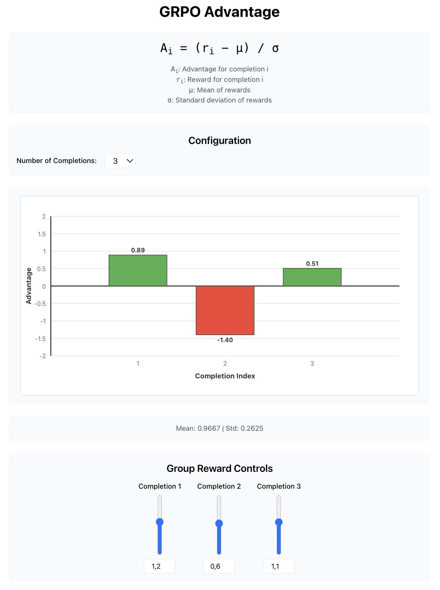

an interactive tool for visualizing grpo's advantage function. you can play around with the individual completion rewards and observe the resulting advantages. the purpose is to provide an intuitive understanding of how advantage values are standardized based on the mean and standard deviation of rewards.

---



## run yourself

to get a local copy up and running, follow these simple steps.

### prerequisites

make sure you have node.js and npm installed on your machine.

### installation

1.  clone the repo
    ```sh
    git clone https://github.com/leonericsson/grpo-viz.git
    ```
2.  install npm packages
    ```sh
    npm install
    ```

### running the app

to run the app in development mode:

```sh
npm start
```